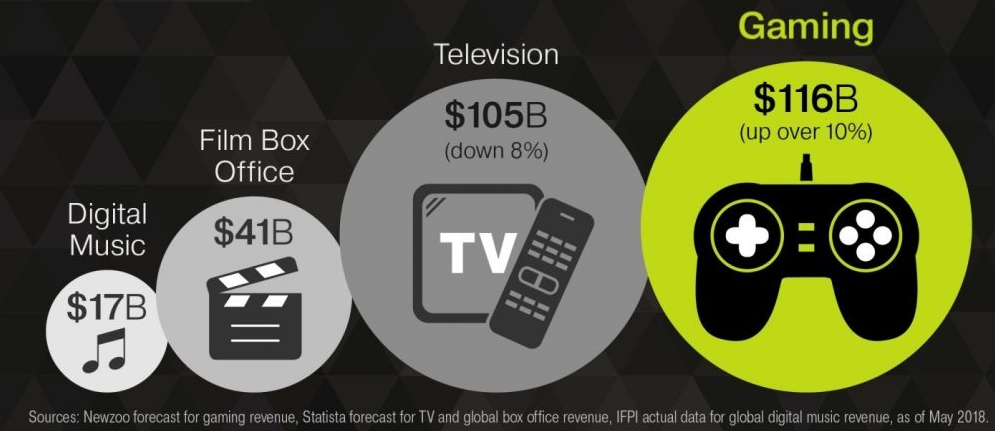
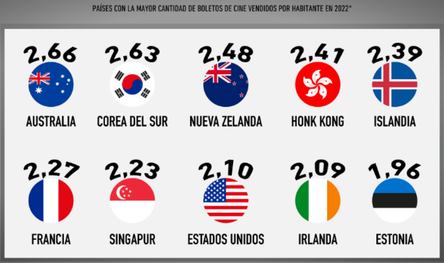

# Proyecto Individual - 01

**TEMA:** 'Henry, Zona de CINÉFILOS'

[Link del video](https://drive.google.com/file/d/1PgzsYgdVSkfpbMUO9gf6_rO2LZsawJ0B/view?usp=sharing)

[Link de la API en Render](https://srptest.onrender.com)

[Link del Repo](https://github.com/jcordovaj/testpi/tree/main)

## Brief del Proyecto: Industria de la Entretención y el Cine

La industria de la entretención es un amplio y diverso eje de la economía mundial, toda vez que, al igual que en la génesis de la sociedad civilizada, un indicador de su desarrollo, es el tiempo libre que las personas pueden comenzar a dedicar a otras actividades, entre ellas, el ocio (como el teatro o artes escénicas y la contemplación), o la filosofía (que posibilitaron el desarrollo de la ciencia y la tecnología), lo que no era factible si estabas dedicado, a tiempo completo, a la recolección, la caza o la autodefensa, cuando la economía era de sobrevivencia.

Esta industria, comprende varios subsectores, no menos complejos o interesantes, como lo son:

* **Cine:** Que incluyen la producción, distribución y exhibición de películas.
* **Televisión**: Incluyendo producción y emisión de programas y series.
* **Música**: La producción y distribución de música y conciertos.
* **Videojuegos**: Implica el desarrollo y comercialización de videojuegos.
* **Publicidad**: Comprenden la creación y difusión de contenido publicitario.
* **Streaming y plataformas digitales**: Que incluye los servicios de transmisión en línea de música, películas, series y otros contenidos.
* **Artes escénicas**: Tales como, teatro, ópera, danza y otras formas de arte en vivo.
* **Eventos en vivo**: Podemos incluir, conciertos, festivales, espectáculos deportivos y otros eventos en vivo.

La industria del entretenimiento genera miles de millones de dólares cada año. Estos ingresos provienen de diversas fuentes, tales como: la venta de entradas, la publicidad, las suscripciones, las ventas de música y películas, memoralia, merchandising, royalties o acuerdos de licencia, entre otros. Es importante tener en cuenta que los ingresos pueden variar significativamente de un año a otro debido a externalidades (pandemia), o a factores como: el éxito de las producciones, popularidad de los actores y la demanda del público.

En la actualidad, la historia del cine acumula más de 100 años de eventos registrados, desde que se capturaron las primeras imágenes.

El cine, es un modo de entretenimiento que hoy está, profundamente, arraigado en la cultura popular de los países, y es casi es tan popular como una 'Coca-Cola'.

Aunque el peso porcentual del cine, respecto a otros componentes de esta industria o de las economías de cada país, puede variar en diferentes regiones y momentos, siempre ha sido uno de sus pilares pero, en la actual era del streaming y las plataformas digitales, otros medios de entretenimiento han ganado terreno (incluso las apuestas). Aun así, el cine sigue siendo una industria significativa y genera una parte considerable de los ingresos totales por concepto de entretenimiento.

Existen varias bases de datos y plataformas de consulta que proporcionan información sobre películas, series, música y otros aspectos de la industria del entretenimiento. Algunas de ellas son:

* **IMDb (Internet Movie Database)**: una de las bases de datos más populares y completas de información sobre películas, programas de televisión, actores, directores y más.
* **Rotten Tomatoes**: un sitio web que recopila reseñas de películas y programas de televisión y proporciona calificaciones agregadas.
* **Box Office Mojo**: una base de datos especializada en información sobre ingresos de taquilla de películas.
* **Spotify, Apple Music, y otros servicios de streaming de música**: plataformas que ofrecen una amplia biblioteca de música y datos sobre reproducciones y popularidad de canciones y artistas.

Una de las principales aplicaciones de un sistema de consulta, incluso de recomendación de películas, es satisfacer necesidades de información y dirigir el ocio hacia intereses compatibles con los gustos del usuario, cuestión que lo hace interesante para la industria de la publicidad, distribución de contenido, merchandising, video on-demand (VOD), etc. Siempre va a ser interesante predecir el consumo humano.

El consumo de cine, varía de un país a otro y, aunque está afectado por variables similares, sus pesos relativos son diferentes, porque dependen de otros aspectos culturales, como por ejemplo la identidad nacional, por eso es probable, que un éxito mundial, no tenga el mismo impacto porcentual, frente a una producción local en el mercado chino o indio.

Algunos de los principales consumidores de cine en términos de horas de visualización son países como Estados Unidos, China, India, Reino Unido, Francia y Japón. Estas cifras fluctúan, como mencioné, debido a factores culturales, la popularidad de los actores, bienes o servicios sustitutos a la industria cinematográfica, la disponibilidad de cines y la penetración de servicios de streaming, entre otros.

Los géneros cinematográficos varían según las preferencias culturales y los gustos del público en diferentes países. Hay géneros populares y más comunes que incluyen acción, comedia, drama, ciencia ficción, animación, romance y suspenso. Sin embargo, es importante destacar que la popularidad de los géneros puede cambiar con el tiempo y puede haber diferencias regionales significativas.

El gasto promedio per cápita en cine también puede variar de un país a otro. Algunos países pueden tener una cultura de asistencia frecuente al cine y un mayor gasto en boletos y productos relacionados, mientras que en otros países, el gasto puede ser menor. El gasto per cápita en cine también puede estar influenciado por factores económicos, el costo de las entradas de cine y la disponibilidad de cines.

Por todo esto, se requiere hcer análisis de los datos, identificar variables relevantes, entender cómo se comportan y modelarlas para producir información significativa.

## Descripción del problema

El ciclo de vida de un proyecto de DS se puede extender desde la captura, el tratamiento (higienización, deduplicación, transformaciones y carga), la recolección de los datos hasta el entrenamiento y mantenimiento de un modelo de ML y su actualización, cuando recibe nuevos datos.

Se dispone de de dos set de datos históricos sobre películas (movies), equipo (credits).

El rol a desempeñar es como **`Data Scientist`** para una start-up que provee servicios de agregación de plataformas de streaming. Se solicita crear un modelo de ML que provea recomendaciones, el que aún no ha sido puesto en marcha.

**Primero**: Analizar la madurez de los datos (raw-data) y efectuar las tranformaciones para dejarlos en estado funcional (clean-data).  Se observan: Datos anidados, sin transformar, no hay procesos automatizados para la actualización de nuevas películas o series, entre otras cosas, problemas que se dividen en la operativización de los datos históricos hasta poder ser consultados a través de una API.

**Segundo**: Generar un modelo de ML.

### Entregables - Outputs

**Parte 1**: Un **`MVP`** (*Minimum Viable Product*), consistente en un set de datos operacional, 6 funciones de consulta que despliegan datos y su implementación como webservice para ser consumido a través de la red. Se proveerá un proyecto montado en Github conteniendo, las carpetas con los datos originales y datos operativos (rawdata y cleandata), un notebook con la memoria de cálculos y transformaciones, un programa principal (main.py), escrito en Python 3.11, un archivo de 'requirements.txt', carpeta de documentación (readme.pdf, copia de readme.md), carpeta de pruebas. El despliegue se hará usando Render, y se proveerá un link para su consulta en linea.

**Parte 2**: Incluye códigos o scripts '.py' y/o 'Jupyter Notebook .ipynb', el  EDA, feature engineerging.  Para resolver esta parte del Lab, evaluando los problemas que había con la plataforma y performance, y luego de leer muchas soluciones y entender los modelos subyacentes, se hizo un desarrollo propio que recoge esas experiencias. El modelo, utiliza un clasificador que lee los géneros con los que fue categorizada la película, tomando la lista de atributos y los almacena en una matriz de resultados, la que cruza con los valores similares de otras películas de la bbdd, luego ordena las películas que tienen mejor coincidencia y las ordena por popularidad, devolviendo una lista con las mejores 5 opciones, de acuerdo al tipo de película. Este cambio obedece a problemas de procesamiento y espacio en Render. Esta solución MVP, resuelve el problema funcional y técnico, al optimizar los recursos y mejorar la perfomance en la respuesta. El modelo soporta, múltiples factores y ponderadores, con muy pocos cambios a nivel de programación  y permitiría mejorar los resultados, aunque ya son bastante buenos.

En ambos casos se documentará cada paso realizado mediante comentarios en el script o textos en formato markdown dentro del notebook, para su trazabilidad y mantenibilidad acorde a PEP 8.
